Linux开发环境搭建与使用——Linux必备软件之Samba - 秋叶原 && Mike || 麦克

版权声明：本博客文章，大多是本人整理编写，或在网络中收集，转载请注明出处！ https://blog.csdn.net/tennysonsky/article/details/44224671

假如我们是在ubuntu环境上做相应的开发，有的时候，我们需要把我们写的程序共享给别人，或者，自己拷贝出来备份一份。我们习惯用U盘拷贝，如果需要频繁拷贝的话，这样会不太方便。这里给大家介绍一种更好的方法：通过Samba服务器共享。  

Samba是在Linux和UNIX系统上实现SMB协议的一个免费软件，由服务器及客户端程序构成。

Samba服务器在两种不同操作系统间架起了一座桥梁，使Linux系统和Windows系统之间能够通信。通过Linux操作系统下的samba服务，可以实现Windows主机访问Linux下共享文件的功能，为广泛的Linux爱好者提供了极大方便。  

首先，我们需要在ubuntu环境里安装samba。  

安装命令，如下：

**sudo apt-get install samba smbfs smbclient system-config-samba**  

**如果是Ubuntu 14.04 版本，请以此命令安装：sudo apt-get install samba samba-common system-config-samba python-glade2 gksu  **

samba：samba核心组件。  
smbfs：支持SMB/CIFS协议的文件系统。  
smbclient：samba客户端，访问其它机器。  
system-config-samba：图形界面配置工具。  

  

**通过图形界面对Samba进行相应的配置：**  

1）添加用户

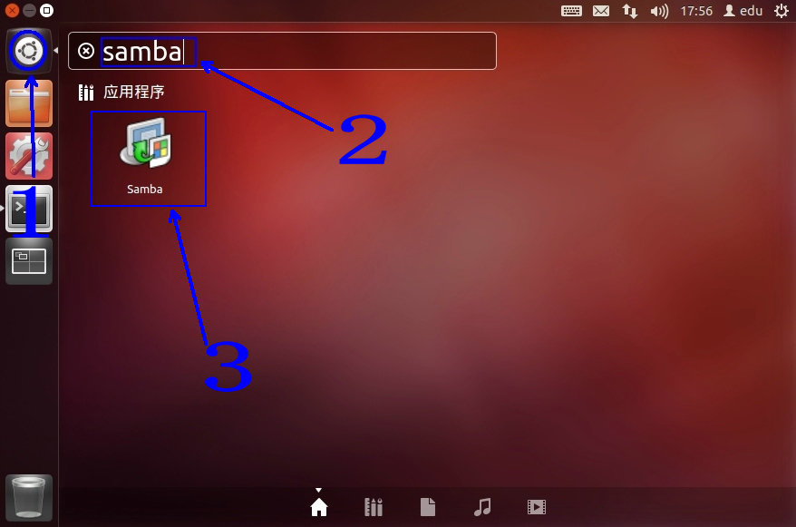  

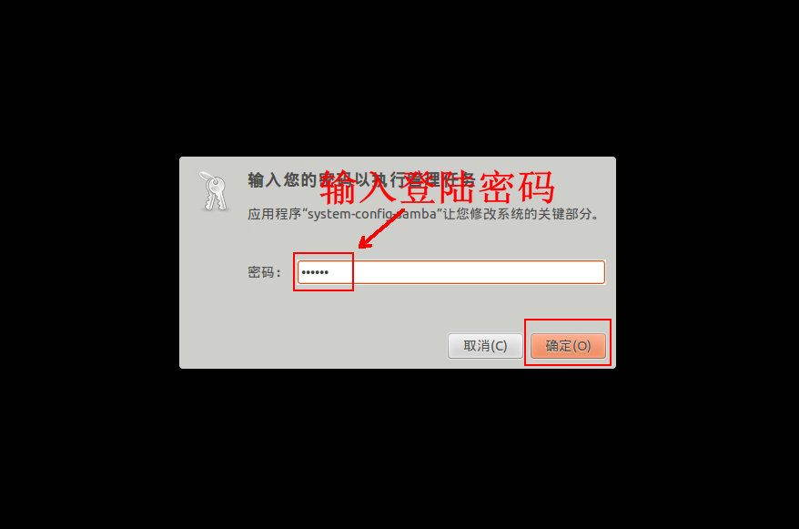  

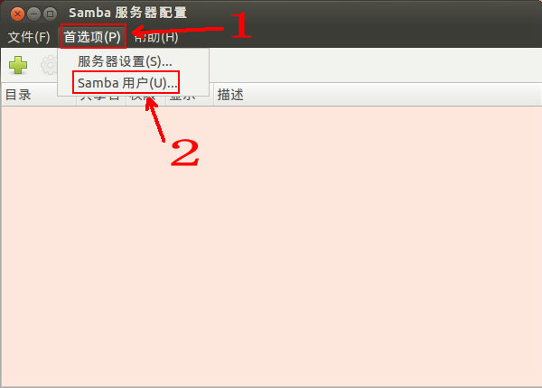  

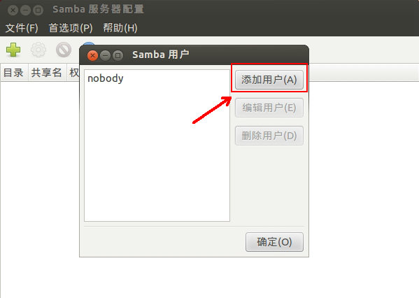  

  

2）设置Linux共享目录及其权限  

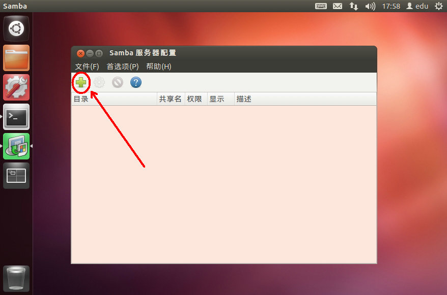  

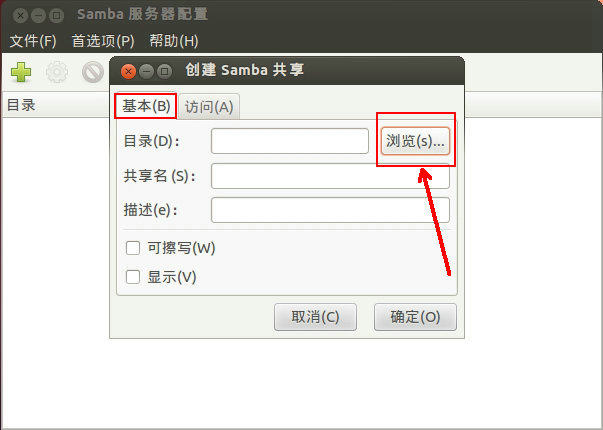  

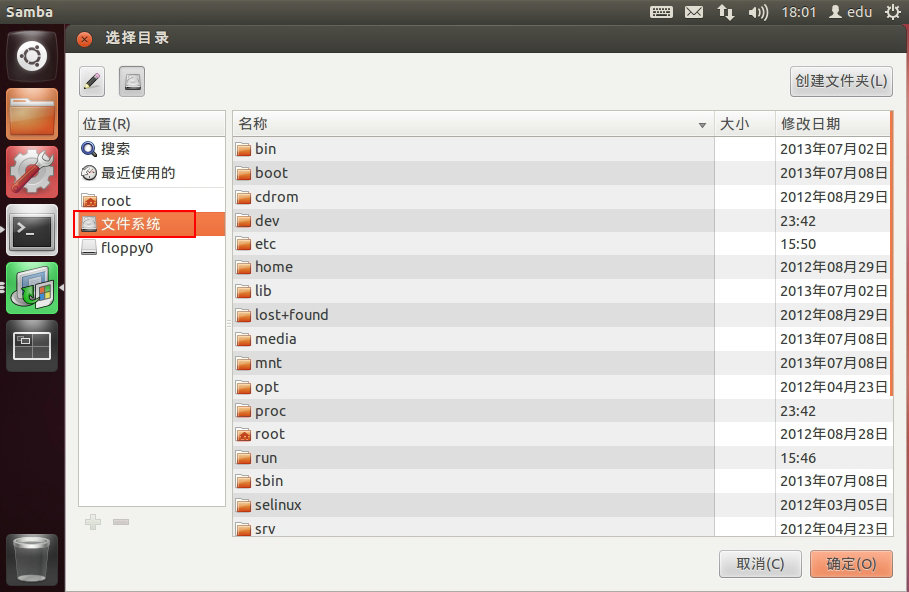  

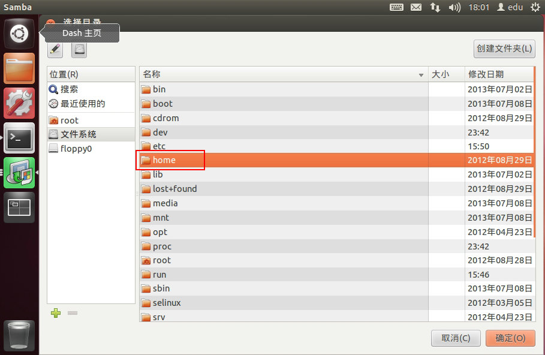  

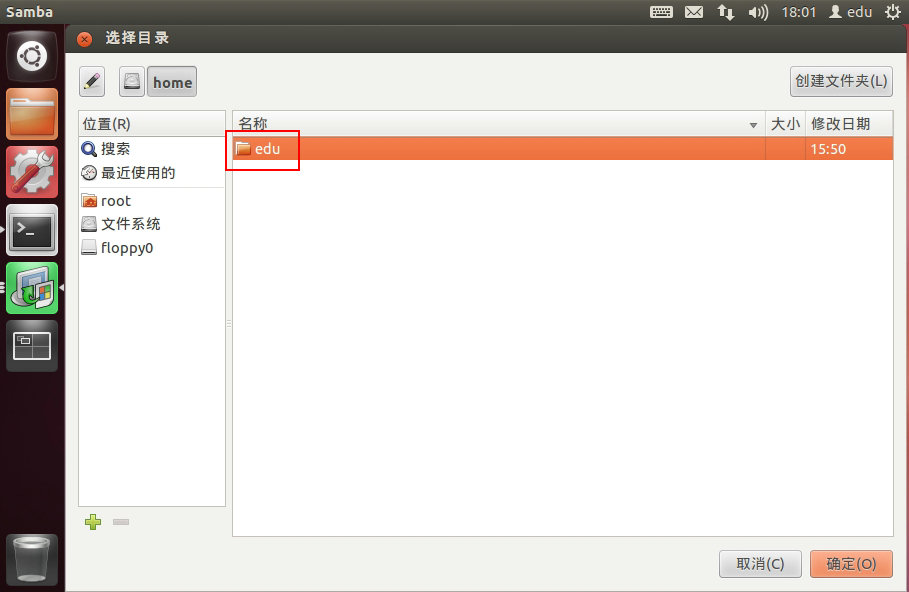  

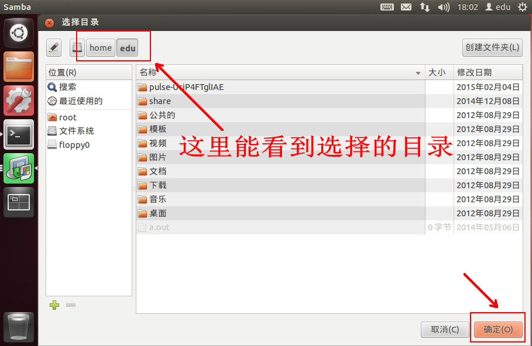  

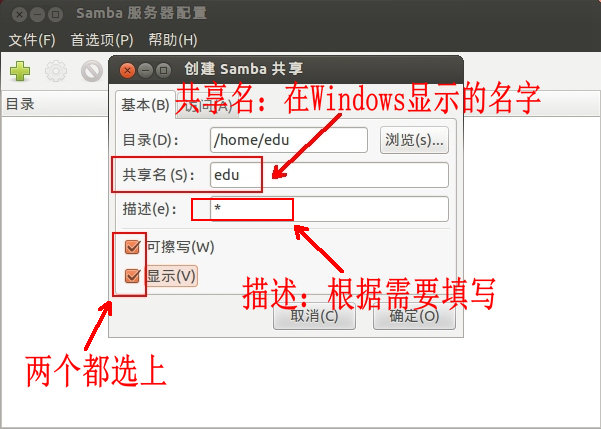  

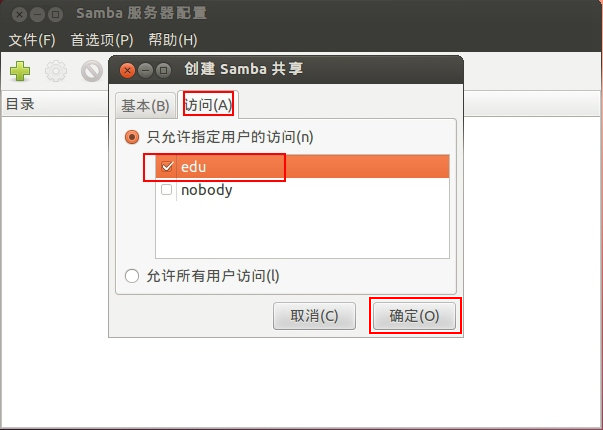  

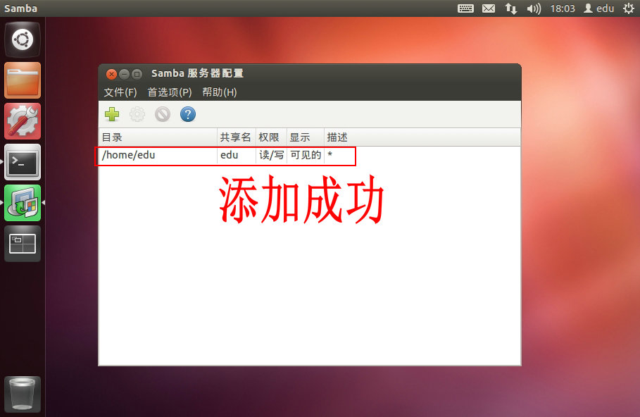  

**3、测试使用**  

1）如果是某个Windows主机要访问ubuntu的共享目录，这两系统的网络必须要能平通，否则，无法访问，下图为ubuntu去平Windows的ip：

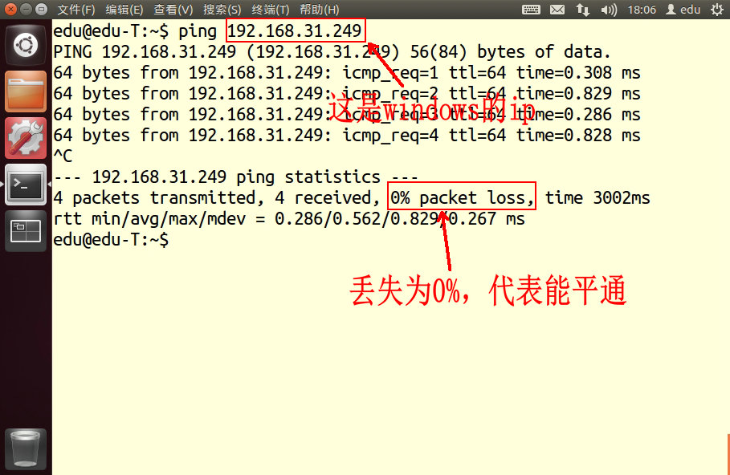  

2）获得ubuntu的ip，在终端下敲：ifconfig。  

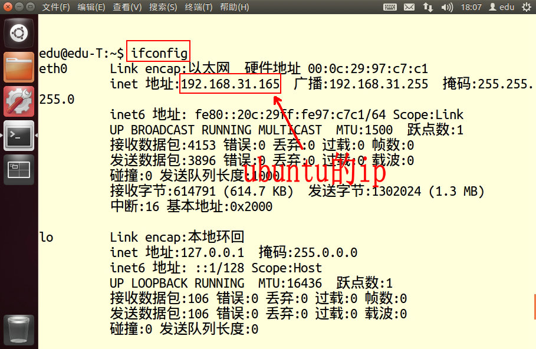  

3）访问samba共享目录，在Windows主机中操作：开始-->运行-->\\\10.220.x.x(ubuntu的ip)\\share(共享名)：  

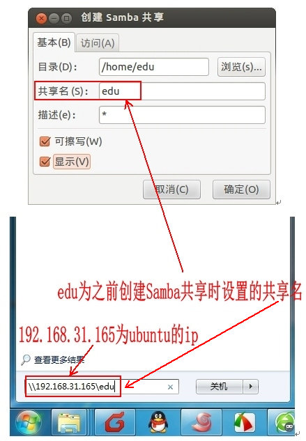  

4）输入用户名、密码：  

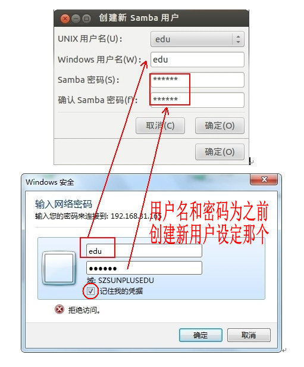  

5）进入共享目录：

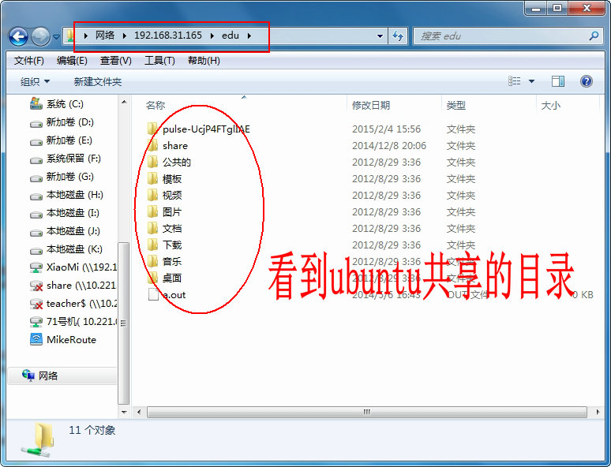  

**映射网络驱动器**

以后访问ubuntu这个共享目录，都要在Windows主机中操作：开始-->运行-->\\\10.220.x.x(ubuntu的ip)\\share(共享名)，这个会很麻烦。下面给大家介绍一个好方法：映射网络驱动器。

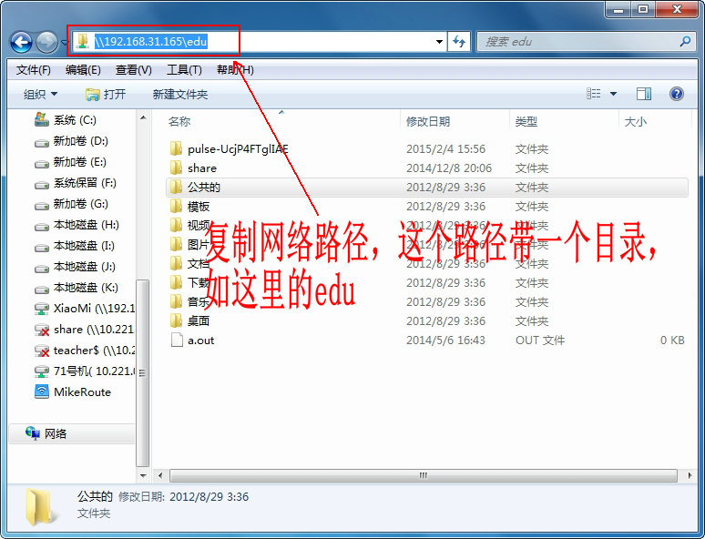  

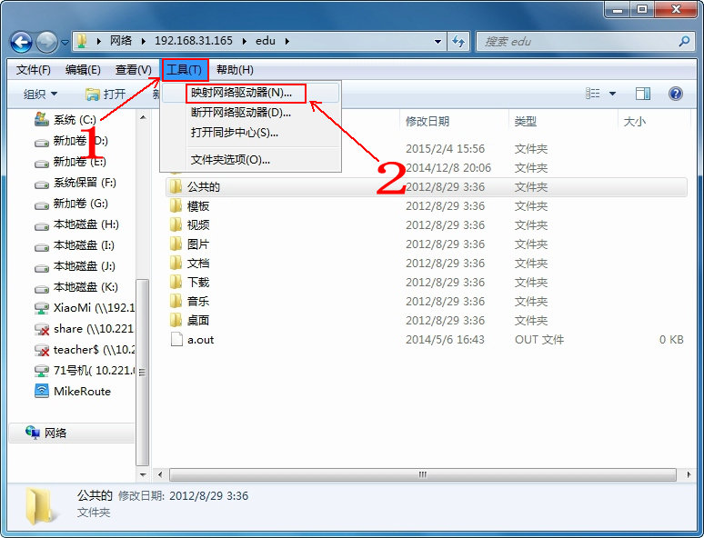  

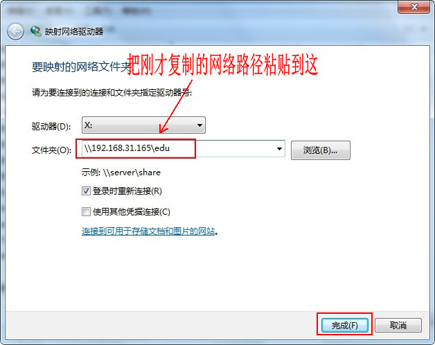  

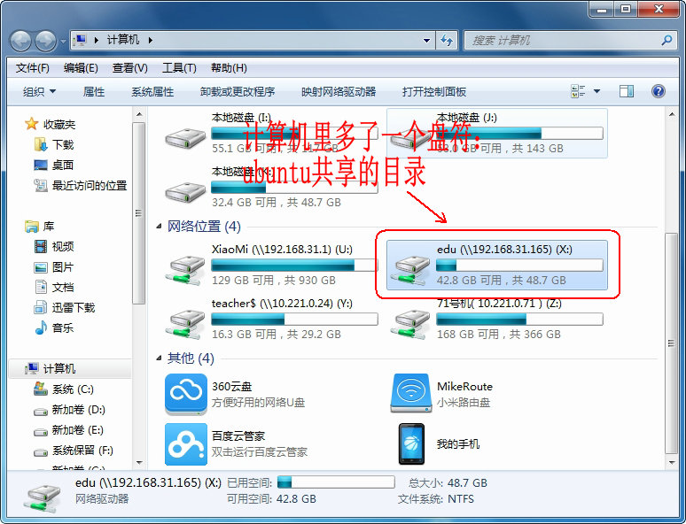  

以后我们直接打开我的电脑，即可看到这个共享目录，直接打开即可（前提是ubuntu已经开启了）。如果我们不想使用了，也可断开个网络驱动器：

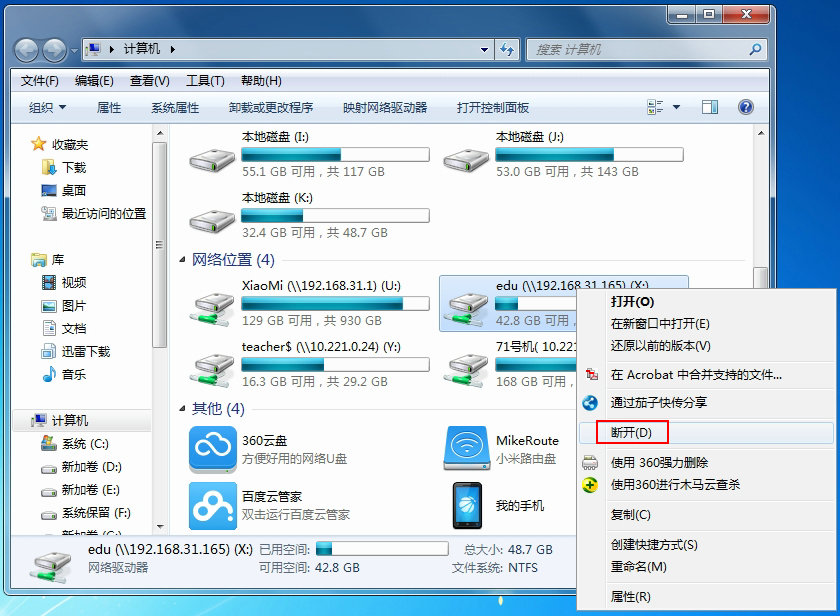  

**如果samba服务出现问题，可以重启服务：**  

sudo service smbd restart