了解 Git 的工作方式，而不仅仅是了解命令

Git，自我提醒

Git 是一种常用的分布式源代码库。它是由 Linux 创作者 Linus Torvalds 创建的，旨在管理 Linux 内核源代码。GitHub 等整体服务都是基于它创建的。甚至 IBM 的 [DevOps Services](https://hub.jazz.net/?utm_source=dwchina&utm_campaign=bluemix&utm_content=d-learn-workings-git&utm_medium=article) 和 IBM Rational Team Concert™ 源代码库也使用它。因此，如果您想在 Linux 领域中编写程序，或者是结合使用 IBM 的 DevOps Services 和 Git，则对 Git 有很好的了解会很有帮助。

当我开始使用 Git 时，我拥有 Concurrent Versions System (CVS) 和 Apache Subversion (SVN) 方面的经验，因此我试着从这些经典源代码库系统方面来了解它。这种思考方式让我对 Git 的能力了解有限。从那时起，我对 Git 的了解逐渐增加，本文是一种 “自我提醒” 方式的记录，提醒自己 Git 的工作方式并向新手介绍 Git。我假设您了解其他经典源代码库（比如 CVS 或 SVN）的工作方式。

## 基础知识

从经典源代码库中的一个基本示例开始，如图 1 所示。在经典源代码**库**中，会将包含文件和子文件夹的文件夹视为**内容**进行处理（CVS 和 Git 实际上不会处理文件夹，仅处理路径位置下的文件）。存储库包含所有内容版本，而**工作目录**是修改代码的位置。将代码从存储库**签出（checkout）**到工作目录，并将在此工作目录中所做的更改**提交**给存储库中的新内容版本。

##### 图 1\. 经典源代码库工作区处理

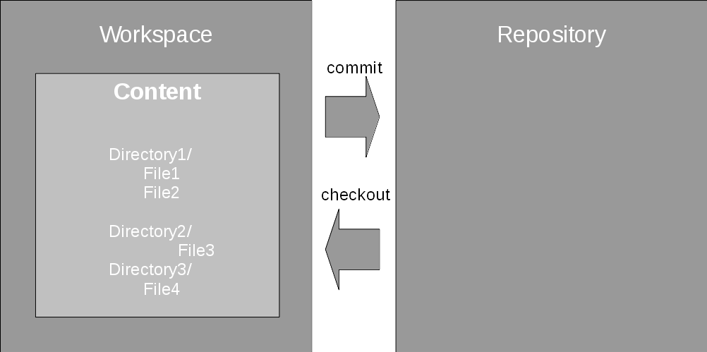

[点击查看大图](https://www.ibm.com/developerworks/cn/devops/d-learn-workings-git/#N10064)

每次提交创建一个来自之前修改的**父**版本的新子内容版本，如图 2 所示。内容存储为一系列版本，也称为**快照**，由提交操作创建的父子关系进行链接。提交的父版本和子版本之间的信息更改称为**变更集**。

此系列版本称为**流**或**分支**。在 SVN 中，主要流称为 **trunk**；在 CVS 中它通常称为 **HEAD**；在 Git 中它通常称为 **master**。可以在实施项目中使用分支来分离特定功能开发，或者使用分支维护旧版本。

##### 图 2\. 在经典存储库中创建新版本

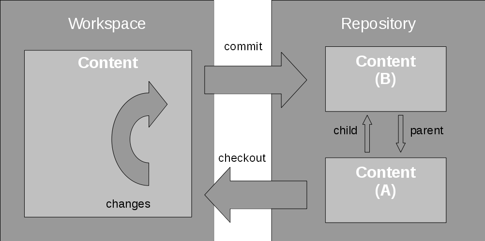

[点击查看大图](https://www.ibm.com/developerworks/cn/devops/d-learn-workings-git/#N1008A)

到目前为止，Git 看起来很像此类经典源代码库，是吧？不幸的是，相似之处到此就结束了。CVS 和 SVN 的一个主要特点是它们拥有一个中央存储库。Git 是分布式的。多个存储库可以在软件开发中一起工作，实际上，每个开发人员的存储库与任意基于服务器的 Git 存储库的工作和通信方式相同。

## Git 如何工作？

一旦您真正了解了 Git，会发现它的主要原则非常简单。

首先，Git 以快照方式处理内容，每个提交一个快照，并且知道如何在两个快照之间应用或回滚变更集。这是一个重要的概念。在我看来，了解应用和回滚变更集的概念让 Git 更容易理解，且使用起来更加简单。

这是真正的基本原理。其他一切都是由此衍生的。下面深入介绍一下 Git。

### 使用 Git

要开始使用 Git，只需要运行 "`git init`" 命令。这会将当前目录直接转换为 Git 工作目录并在此处创建的 `.git`（隐藏）目录中创建存储库。然后就可以开始使用 Git 了。`**checkout**` 和 `**commit**` 命令与其他源代码库中的同名命令相同，但关注变更集是因为在 Git 中添加了 `**add**` 命令（与 SVN 相同）。使用此命令，会将工作目录中的更改添加到下一次提交的暂存区。此暂存区通常名为 **index**。图 3 展示了从快照版本 A 到快照版本 B 创建变更集的过程。

`**git status**` 有助于跟踪已添加的更改、未添加的更改以及更改所在的分支。

##### 图 3\. 在 Git 中创建变更集

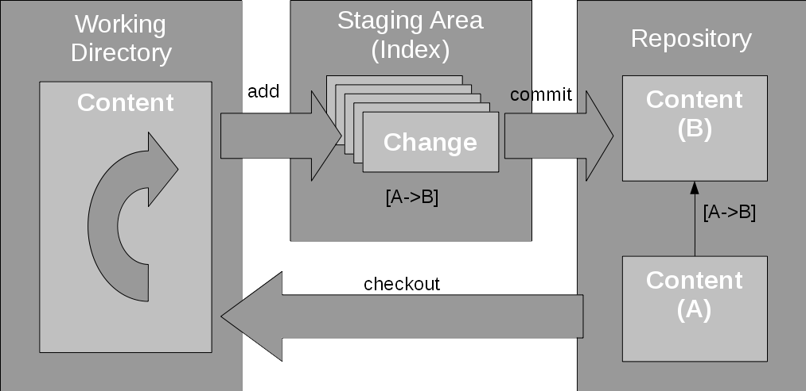

[点击查看大图](https://www.ibm.com/developerworks/cn/devops/d-learn-workings-git/#N100D5)

`**git log**` 显示工作目录中的更改（即提交）历史，或者使用 `**git log <path>**` 显示应用于指定路径的更改。

尽管 `**git status**` 列出了工作区中的修改文件和 index 中的文件，但是您可以使用 `**git diff**` 命令查看文件之间的差异。仅使用 `**git diff**`（不使用参数）会只显示工作目录中已添加到 index 的更改。需要使用 `**git diff --cached**` 来查看 index 中的实际内容：暂存的更改。`**git diff <name>**` 或 `**git diff <name> -- <path>**` 显示当前工作目录和工作目录的命名提交或指定路径之间的差异。名称可能是 commit ID、分支名或其他名称。这是介绍命名的好机会。

### 命名

**备注：**  
由于 commit ID 很长，我在图中仅使用缩写词，比如 "(A)"、"(B)" 等。

我们来看一下 Git 中的命名方式。快照是 Git 中的主要元素。它们被命名为 **commit ID**，这一种哈希 ID，比如 "c69e0cc32f3c1c8f2730cade36a8f75dc8e3d480"。这是来自快照的内容，由实际内容和一些元数据组成，比如提交时间、作者信息、父内容等。快照没有 CVS 的**点数字版本**，也没有 SVN 的**交易号**（和 /branches 顶级目录下的路径)。因此，与在其他存储库中一样，从 Git 快照名中无法确定任何顺序。为了方便起见，Git 可以将这些长哈希值缩写为短名称，方法是从 ID 开头提取最小字符数量，这样短名称在存储库中仍然是惟一的。在上述示例中，短名称是 "c69e0cc"。

注意术语**提交（commit）**，作为动词是创建快照，而作为名词是生成的快照。

通常不需要使用 commit ID；而是使用分支。在其他源代码库中，更改的命名流被称为分支。在 Git 中，更改流是一个有序的变更集列表，因为它们是一个接一个地应用于快照的。Git 中的**分支** 只是具体快照的指定指针。它记录使用此分支时新更改要应用的位置。将更改应用于分支时，分支标签会移动到新提交。

Git 如何知道将来自工作区的更改放在哪里？这就是 HEAD 指向的位置。开发的 HEAD 是您最后签出工作区的位置，并且最重要的是，这也是提交更改的位置。它通常指向最后签出的分支。请注意，这与 CVS 对术语 HEAD 的诠释不同，因为这将作为默认分支的开发提示。

`**标签（tag）**` 命令命名提交，并允许使用一个可读的名称解决各个提交。基本上，标签是 commit ID 的别名，但也可以使用一些快捷方式解决提交。HEAD 是工作目录中的开发提示。HEAD^1 是 HEAD 提交的第一父提交，HEAD^2 是第二父提交，以此类推。

有关更多细节，请参见 **gitrevisions** 的帮助页面。由于标签或分支名称等名称是提交的引用，因此将它们命名为 **refnames**。**reflog** 显示在名称的生命周期内更改的内容、何时由谁创建（通常由分支创建），以及当前状态。

### 分支

分支背后的理念是每个快照可以有多个子快照。为同一快照应用第二个变更集会创建一个新的单独的开发流。并且如果对它进行命名，会将它命名为 branch。

##### 图 4\. Git 中的示例分支结构

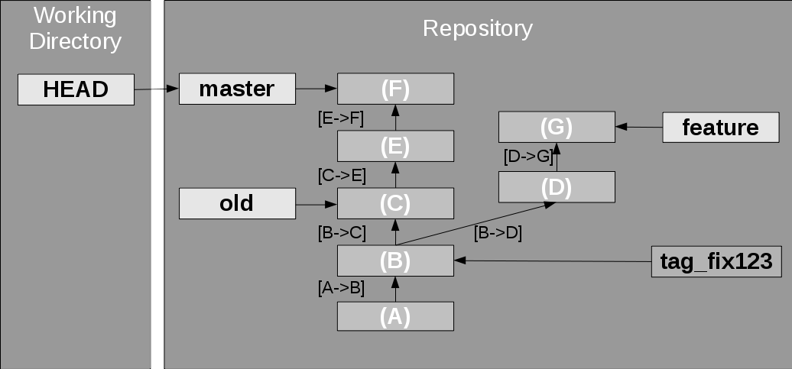

[点击查看大图](https://www.ibm.com/developerworks/cn/devops/d-learn-workings-git/#N10153)

图 4 用 Git 中的一个示例分支结构演示了这一点。**master** 分支是目前指向**快照 F** 的一些开发。另一个 **old** 分支表示较旧的快照，也许是可能的修复开发点。**feature** 分支具有特定功能的其他更改。变更集是从一个版本到另一个版本，例如 "\[B->D\]"。在本例中，快照 B 有两个子快照，并且它有两个开发流，一个是针对功能分支的开发流，另一个是针对其他内容的开发流。提交 A 也被标记为修复 bug 号 123。

分支是对当前 HEAD 使用 `**git branch <branch name>**` 命令创建的，或者是对任意有效快照版本使用 `**git branch <branch name> <commit id>**` 命令创建的。这会在存储库中创建一个新的分支指针。_小心，以这种方式进行分支会__让工作区保持为旧分支。您首先需要签出新分支。_使用 `**git checkout -b <branch name>**` 命令会创建新分支，并且您的工作区也会移动至新分支。

另外两个命令也非常有用：

*   `**git diff <branch> -- <path>**` 如上所述，输出当前工作目录和指定分支之间指定路径（文件或目录）的差异。
*   `**git checkout <branch> -- <path>**` 将文件从不同的分支嵌入到工作目录，这样就可以从另一个分支选择更改。

### 合并

实施新功能时，您会将它签入到存储库，例如，签入到 "feature" 分支的存储库中。功能完成后，您需要将它合并到主分支。可以通过签出主分支并使用 `**git merge <branch name>**` 命令来完成此操作。然后，Git 会将指定分支的更改合并到签出分支中。Git 实现此操作的方法是，将所有变更集从功能分支应用至主分支。

根据两个分支中的更改类型和可能产生的冲突，可能会出现三种可能性。

*   **快进（Fast forward ）合并**：接收分支不会获得任何更改，因为两个分支分叉了。接收分支仍指向另一个分支分叉之前的最后一次提交。在这种情况下，Git 会将接收分支的分支指针向前移动，如图 5 所示。因为除了将分支指针向前移动外什么也做不了，所以 Git 将此过程称为快进合并。

##### 图 5\. 快进合并

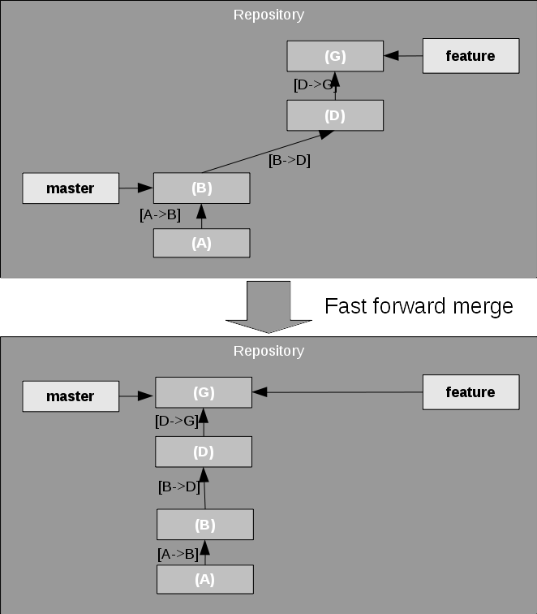

[点击查看大图](https://www.ibm.com/developerworks/cn/devops/d-learn-workings-git/#N101B8)

*   **非冲突合并**：两个分支都有更改，但它们并不冲突。例如，如果两个分支的更改影响不同的文件，就会出现这种情况。Git 可以自动将其他分支的所有更改应用至接收分支，并创建一个包含这些更改的新提交。然后，接收分支将向前移动至此新提交，如图 6 所示。

注意生成的提交，**merge commit** 有两个父提交。我没有注意到这里的变更集。原则上，从 (E) 到 (H) 的变更集将是子两个分支分叉后来自功能分支的所有变更集的合并，但这可能将类比弄过了头。

##### 图 6\. 非冲突合并

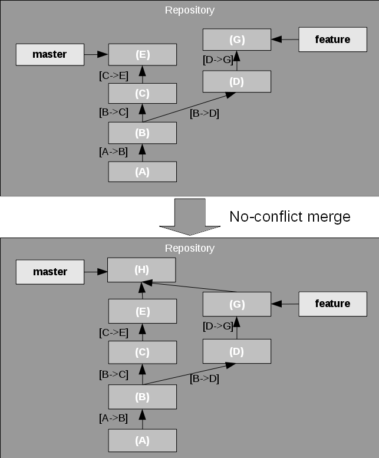

[点击查看大图](https://www.ibm.com/developerworks/cn/devops/d-learn-workings-git/#N101CC)

*   **冲突合并**：两个分支都有更改，但它们是冲突的。在这种情况下，冲突结果会保留在工作目录中，留给用户进行修复并提交，或者是使用 `git merge –abort` 命令终止合并。

有一点很有趣且值得注意：合并寻找同一补丁应用至两个分支的实例。由于两个分支都有更改，这通常会导致冲突，但是 Git 很智能，可以检测到这种情况，因此仍然可以进行快进合并。

**变基（rebasing）**和**随意选取（cherry picking）**等高级功能进一步发展了回滚和重演变更集的概念。

有时您开发一个功能，但主开发是齐头并进的，您还不想合并功能。结果是两个分支很快会彼此分离开来。但是，可以将变更集从一个分支应用至另一个分支。为此，Git 提供了变基和随意选取功能。

### 变基

假设您正在开发功能，并且需要纳入来自主分支的最新更改以紧跟总体开发。这就称为对功能分支进行**变基**；这会将两个分支之间的分支点向上移动到一个分支。然后，Git 会在另一个分支顶部重演一个分支的更改，为每个原始提交创建新提交。在如图 7 所示的示例中，它尝试在主分支顶部应用来自功能分支的更改。

##### 图 7\. 变基分支

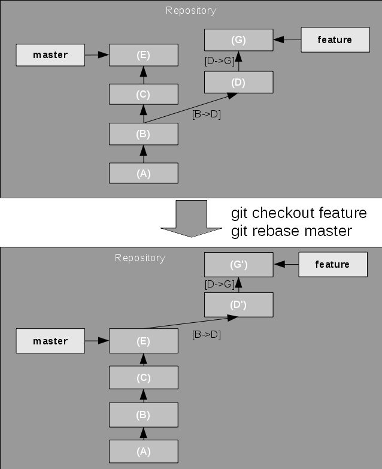

[点击查看大图](https://www.ibm.com/developerworks/cn/devops/d-learn-workings-git/#N101F3)

如果重演导致出现冲突，则变基会在第一次发现冲突时停止，并将冲突状态保留在工作目录中，以供用户进行修复。然后可以继续或终止变基。

使用 `**--onto**` 选项，变基实际上可以将分支点移动到其他分支中的任意新快照上。

### 随意选取

假设您现在正在开发功能，并且已经开发了一些应立即放入主开发的更改。这可能是一个 bug 修复，或者是一个很棒的功能，但您还不想合并分支或对分支进行变基。Git 允许使用随意选取功能将变更集从一个分支复制到另一个分支。

在这种情况下，如图 8 所示，Git 仅将变更集应用至 HEAD（即主分支）上的所选快照。在这里通常实际使用的是 commit ID，也称为哈希值。

##### 图 8\. 随意选取提交

[点击查看大图](https://www.ibm.com/developerworks/cn/devops/d-learn-workings-git/#N10225)

### 还原

`**revert**` 命令在工作目录上回滚一个或多个补丁集，然后创建一个新的提交结果。`revert` 与随意选取是相反的。请查看图 9 来了解示例。

##### 图 9\. 还原提交

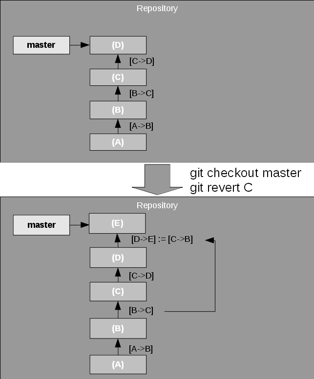

[点击查看大图](https://www.ibm.com/developerworks/cn/devops/d-learn-workings-git/#N1023C)

`revert` 命令将还原记录为新提交。如果您不想进行记录，可以将分支指针重置到较早的提交，但这不在本文的介绍范围内。

那么为什么我会详细介绍这一部分呢？这是因为，在介绍下一部分的协作功能时，它对了解这些功能非常重要。事实上，了解了这个第一部分后，就会了解第二部分了。大多数协作功能都基于目前介绍的基本功能。

## 协作

在经典源代码库中，始终有一个什么是分支的清晰概念；它位于中央存储库。

但是，在 Git 中，没有所谓的主分支。等一下，我是不是在上面写了通常有一个主分支？是的，我是这样写了。但是，此主分支仅存在于本地。一个存储库中的主分支与另一个存储库中的主分支没有任何关系，除非您创建了关系。

##### 图 10\. 两个存储库

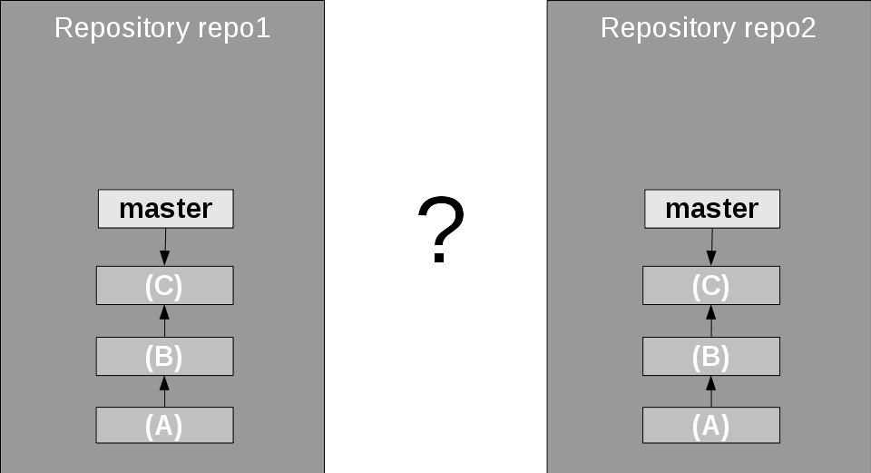

[点击查看大图](https://www.ibm.com/developerworks/cn/devops/d-learn-workings-git/#N10255)

如果您已经有了一个存储库，则可以使用 `git remote add` 命令添加远程存储库。然后，可以使用 `fetch` 命令在自己的存储库中获得远程分支的镜像。这称为**远程跟踪分支**，因为它跟踪远程系统开发。

当您签出仅作为远程跟踪分支（而不是本地分支）存在的分支时，Git 会根据远程跟踪分支自动创建本地分支，并签出本地分支。

在此之后，可以将远程分支的内容合并到自己的分支。图 11 显示签入到了本地主分支，但并不需要如此，您可以使用 normal merge 命令等共同历史将它合并到任意其他分支中。

##### 图 11\. 获取并检查远程分支

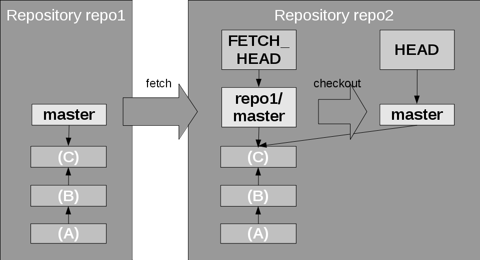

[点击查看大图](https://www.ibm.com/developerworks/cn/devops/d-learn-workings-git/#N1026E)

另一种方法是使用 `git clone` 命令从托管服务获取远程存储库。这会自动获取所有远程分支（但不是本地引用）并检查主分支。

您可以看到，会出现一种模式。由于远程存储库分支 “仅仅是一个分支” ，因此上面介绍的有关分支、合并的所有内容在这里都适用，尤其是从远程存储库获得更改时。

##### 图 12\. 获取远程更改

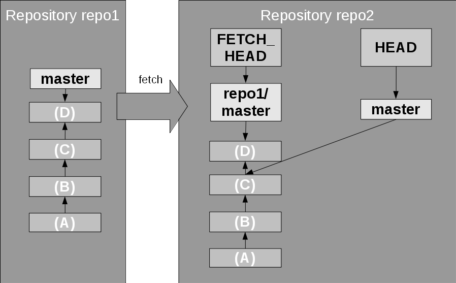

[点击查看大图](https://www.ibm.com/developerworks/cn/devops/d-learn-workings-git/#N1027F)

在图 12 中，显示了 `git fetch`；它更新远程跟踪分支。然后，在远程跟踪分支和本地分支之间执行常规的合并操作，在本例中使用 `git checkout master; git merge repo1/master` 命令。在获取之后，可以在合并命令中使用 `FETCH_HEAD` 名称，将其作为所获取的远程分支的快捷方式，比如使用 `git merge FETCH_HEAD` 命令。此外，与上述讨论类似，这一合并可能是快进合并、非冲突合并或需要手动解决的冲突合并。

`git pull` 命令是一个方便的命令，可结合使用 `fetch` 和 `merge`。

将更改提交给本地分支后，会将更改传输给远程分支。可使用 `push` 命令完成此操作，此命令会将本地更改推送到远程分支。这是 `fetch` 而不是 `pull` 的相反操作。但是，它不仅仅是远程获取，因为它会更新远程分支的本地副本，以及其他存储库中的远程分支，如图 13 所示。`push` 还允许您在远程存储库中创建新分支。

##### 图 13\. 推送更改

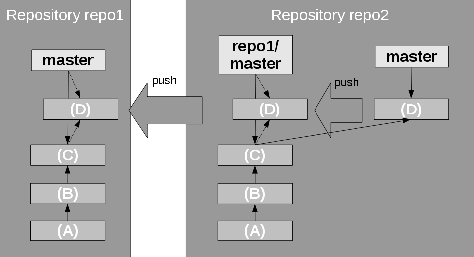

[点击查看大图](https://www.ibm.com/developerworks/cn/devops/d-learn-workings-git/#N102C6)

有一个保护措施。当推送导致对远程存储库中的远程分支进行快进合并时，会成功执行推送，否则会终止推送。如果不是这样，则远程分支可能已经拥有来自其他存储库或提交者的一些更改（提交）。Git 会终止推送并让一切内容保持不变。然后，您必须获取更改，将它们合并到自己的本地分支，并尝试再次推送。

注意，在这种情况下，可以进行常规合并，但还可以进行变基合并，以将本地分支的更改变基为远程分支的新更新 head。

除了 fetch 和 push 命令外，还有另一种分发补丁的方式；是通过邮件的旧方法。为此提供了 `git format-patch <start-name>` 命令，它会为每次提交创建一个补丁文件，将其从指定提交引领至当前分支状态。`git am <mail files>` 会将这些补丁文件应用至当前分支。

### 警告

一个警告：如果您尝试推送到存储库，有人实际在这里跟踪分支并在本地处理分支。这可能会打乱分支管理，因此 Git 会警告您并告诉您首先使用 `pull` 命令同步远程分支的状态。

还要清楚不应该对远程跟踪分支进行变基。它将不再匹配远程分支，因此不会对 `push` 进行快进合并。您已经破坏了存储库结构。

## 高级 Git

##### 图 14\. 多存储库结构示例

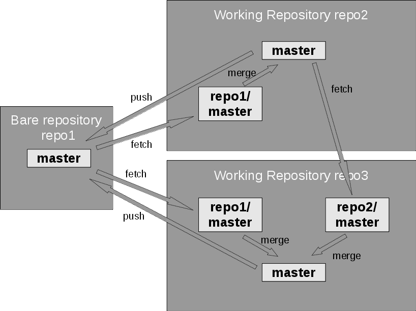

[点击查看大图](https://www.ibm.com/developerworks/cn/devops/d-learn-workings-git/#N102F0)

通常情况下，即使使用 Git，也会出现**星型**结构，其中有一个中央存储库充当主存储库，还未每位用户提供了本地存储库。但并不一定都是如此。例如，您可以使用交叉连接在 Web 中添加远程存储库连接，如图 14 所示。

在上面，我将变基描述为在原始分支的不同分支（或分流）点上重演变更集。Git 通常会以提交顺序进行重演。高级功能 `git rebase -i` 允许您实际选择提交的顺序，即使可以删除提交或者是可以合并两个提交也是如此（“压缩”）。只需确保您不会对已推送的提交进行此操作，否则根据这些提交进行的推送会产生大量冲突。

我已经介绍了如何查看特定分支，还可以查看任意提交（快照）。这会让 HEAD 指针指向提交而不是分支。这称为 **detached HEAD** 模式。在这种情况下提交更改时，会启动新开发流。基本上，您会进行分支，但不会为此新分支命名。只可以使用 commit ID 搜索开发提示；不能使用任意 refname 搜索它。可以通过使用常规的 "`git branch <branchname>`" 命令根据此 HEAD 创建分支。

无法通过任何引用进行搜索的提交会出现什么情况？好吧，如果您不做什么特别的操作，它们会保留在存储库中。但是，托管服务可能会实际运行 `git gc`，Git 垃圾收集器会删除不必要的文件。无法根据任意引用名称搜索的提交是不必要的，因此将删除它们。始终在真正的分支上工作是一种好方法，尤其是当在 Git 中创建新分支是如此简单快速时。

## 结束语

一方面，Git 基于简单的原则，但有时它会提供非常大的灵活性。主要要点是 Git 管理快照及快照之间的变更集。最常见的命令应用并回滚不同分支之间的那些变更集。第二个要点是，处理远程分支与处理本地分支的操作基本相同，因为有一个远程分支的本地镜像。

至此，我已经完成了 Git 工作原理的简单介绍。这些命令基本上涵盖了我使用 Git 可以执行的所有操作。有关所有这些命令的更多信息，可以查看相应的帮助页面。希望本文介绍的这些知识能帮助您更好地了解并使用这些命令。此外，命令本身和 `git status` 通常为下一步操作提供了一些宝贵提示。

另一个有助于了解 Git 的有用工具是图形化的 **gitk** 工具，可现实本地存储库的结构。使用 `gitk --all` 来显示所有分支和标记。它还提供了一个简单的界面来在 Git 上发起操作。

Git 通常已安装在您的 Linux 系统上。您可以需要从软件包管理器安装开发工具。对于 Windows 系统，可以在 [Git 主页](https://www.ibm.com/developerworks/cn/devops/d-learn-workings-git/#artrelatedtopics) 上下载它。

现在，我希望您对 Git 的工作原理已经有了更深入的了解，并且不害怕使用它所提供的灵活性。

感谢我的同事 Witold Szczeponik，他比我更了解 Git，他分享了有关此话题的一些有趣讨论，并对本文进行了审阅。

*   了解 [有关 Git 更多信息](http://git-scm.com/)。
*   阅读 [Git 简介](http://git-scm.com/book/en/Getting-Started-Git-Basics)。
*   了解有关 Git [分支和合并](http://git-scm.com/book/en/Git-Branching-Basic-Branching-and-Merging) 的一些基本信息。
*   通过 [概念性](http://www.sbf5.com/~cduan/technical/git/) 教程了解 Git。
*   [在 Bluemix 上](https://www.ng.bluemix.net/docs/#search/git) 了解人们使用 Git 的不同方式，查看创建的应用程序（并使用代码自己尝试创建应用程序）。
*   尝试 [IBM Bluemix](https://console.bluemix.net/?cm_sp=dwchina-bluemix-_-d-learn-workings-git-_-sidebar)， 这是一个基于开放标准的云平台，用于构建、管理和运行所有类型的应用程序。
*   尝试 [DevOps 服务](https://hub.jazz.net/register?utm_source=dwchina&utm_campaign=bluemix&utm_content=d-learn-workings-git&utm_medium=sidebar)。
*   访问 [IBM developerWorks 中国网站 Rational 专区](http://www.ibm.com/developerworks/cn/rational/)，获得关于 IBM Rational 软件交付平台（Rational Software Delivery Platform）产品的技术资源和最佳实践。

static.content.url=http://www.ibm.com/developerworks/js/artrating/

SITE_ID=10

Zone=DevOps

ArticleID=1002316

ArticleTitle=了解 Git 的工作方式，而不仅仅是了解命令

publish-date=04012015

url=https://www.ibm.com/developerworks/cn/devops/d-learn-workings-git/index.html