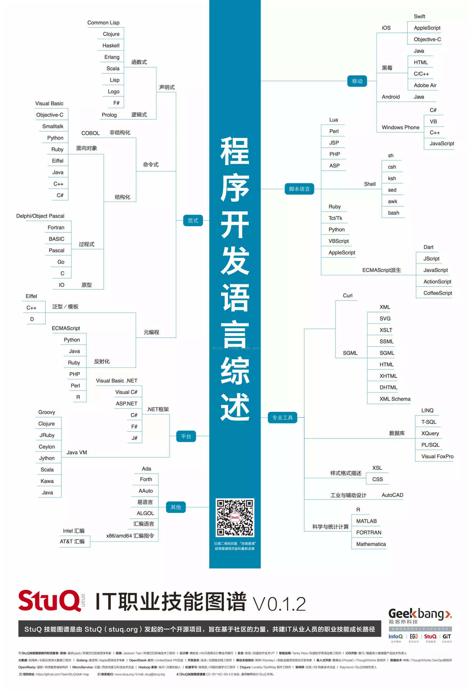
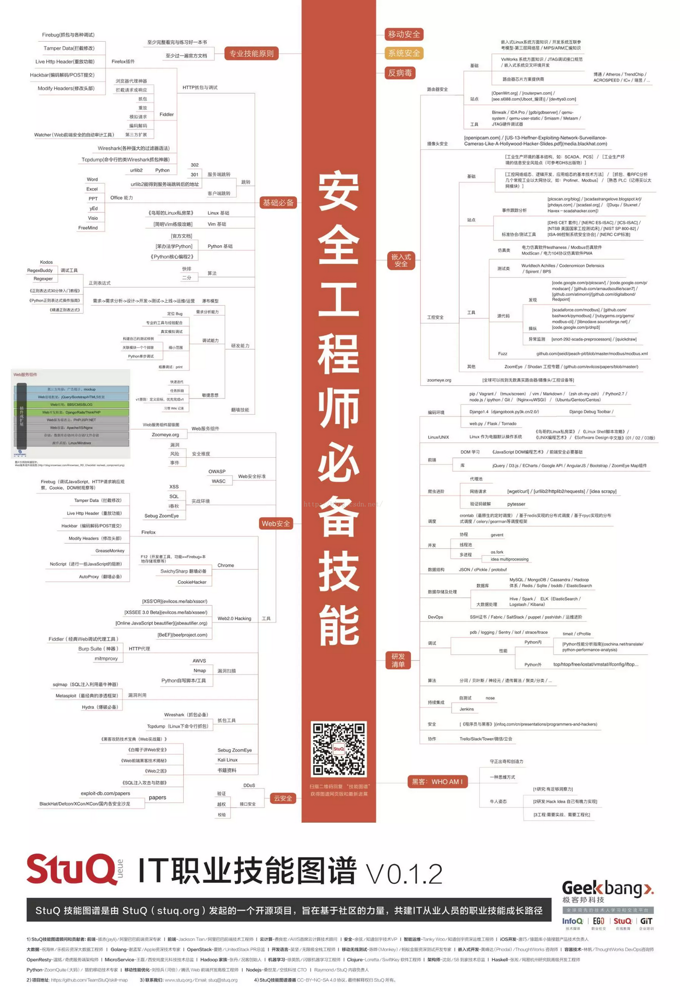
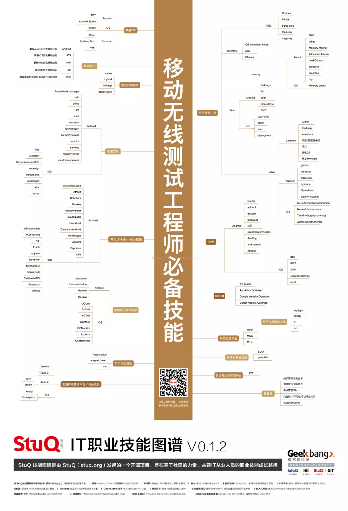
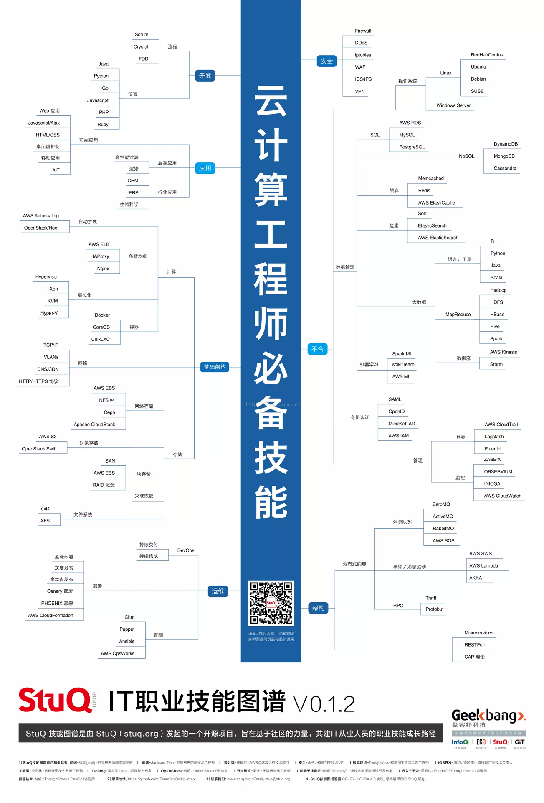
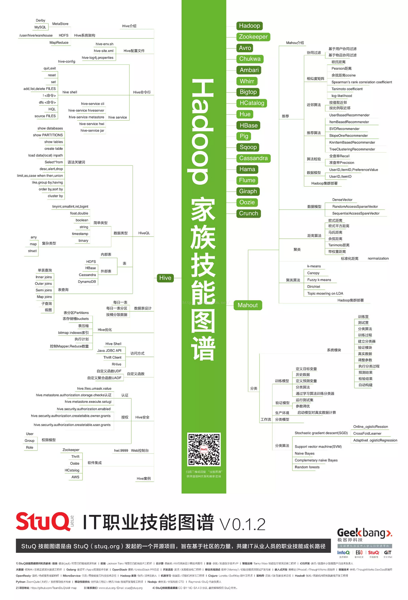
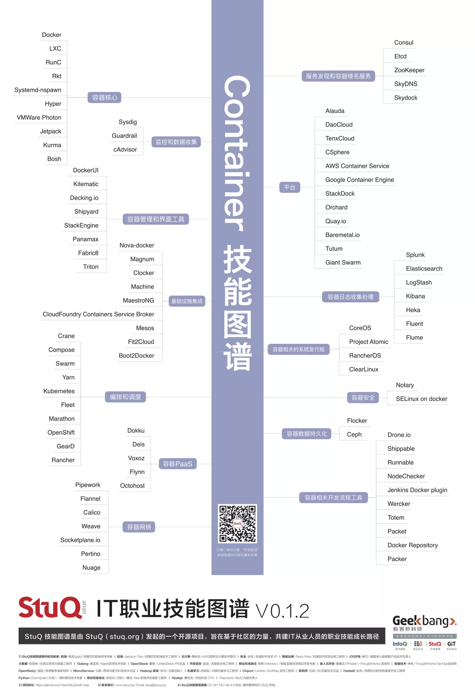

StuQ 技能图谱（全套13张） - ajian005的专栏 - CSDN博客

置顶 2016年04月21日 14:37:47 [ajian005](https://me.csdn.net/ajian005) 阅读数：24894

**程序开发语言综述.jpg  
**

  

**前端工程师必备技能.jpg  
**

**  
**

**大数据工程师必备技能.jpg  
**

**  
**

**安全工程师必备技能.jpg  
**

**  
**

**嵌入式开发必备技能.jpg  
**

**  
**

**iOS开发工程师必备技能.jpg  
**

**  
**

**移动无线测试工程师必备技能.jpg  
**

**  
**

**云计算工程师必备技能.jpg  
**

**  
**

**微服务架构技能图谱.jpg  
**

**  
**

**Hadoop家族技能图谱.jpg  
**

**  
**

**OpenResty技能图谱.jpg  
**

**  
**

**Container容器技能图谱.jpg  
**

**  
**

**运维工程师必备技能.png  
**

**  
**

参考:http://mp.weixin.qq.com/s?__biz=MzA3MjEyNTE4MQ==&mid=505241102&idx=1&[sn](https://www.baidu.com/s?wd=sn&tn=24004469_oem_dg&rsv_dl=gh_pl_sl_csd)=215b2104882cdd92ba8cd076f05ff3a9&scene=23&srcid=0420jbWevdUFMIyMNZi6kcax#rd

 主流编程语言图谱+知识库都在这了 http://geek.csdn.net/news/detail/96883