书法基础｜田英章硬笔书法30种基本笔画笔法全解

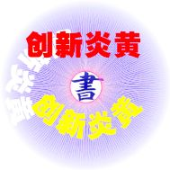

传统文化复兴工程进了校园，还将走入考试。大众书法教育越来越成为学生们、教师们的日常学习任务。以往学习书法只是一种兴趣与课外特长，如今已变成孩子们的必修课程。但不得不说，文化教育需要一种实实在在的载体，更需要有一种时间的训练与学习的积累。

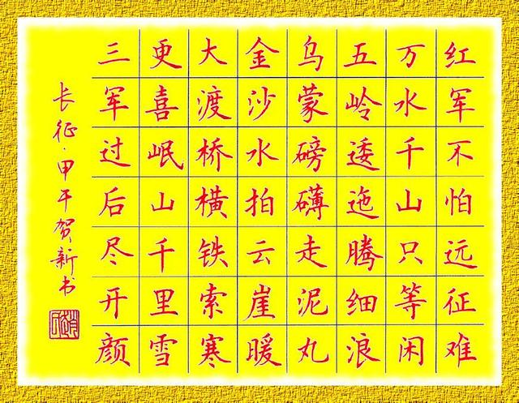
> 图：艺术硬笔的兴起

但是不管怎么说，练习硬笔书法总比练习毛笔书法来得实用。只要你坚持练习，你的作业，你的考试就会在不知不觉中变得与以往有所不同。悄悄的，你的成绩也就发生了变化！

附：田英章硬笔楷30种基本笔画书写经验介绍。

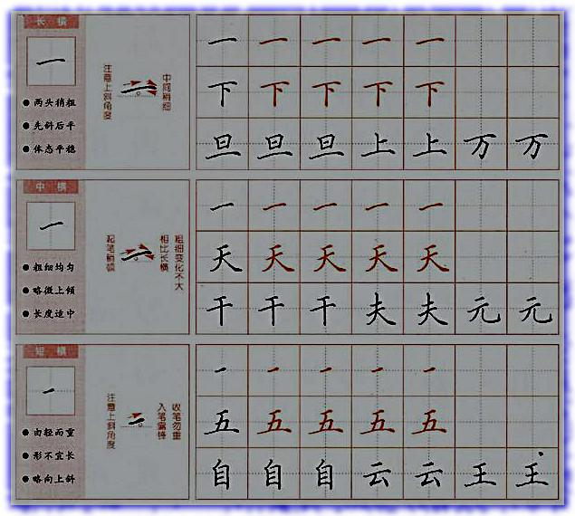
> 图：楷书中最简单的横画书写方法；

横画实际上分为长横、中横与短横。在书写技巧中变化因素并不是特别巨大。长横一般位于独体或是上下结构字的中部或下部。少数情况如“下”“亠”的形态才出现。这个时候适用的是欧阳询36法的“上盖者”的规则，下部的笔画都掩藏在长横之下内。其它还有中部“横担”与“地覆者”的书书写情况。长横大多“横平”。

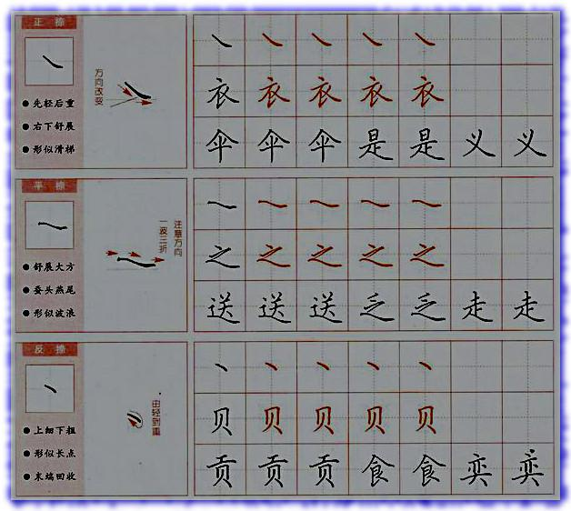
> 图：捺的书写方法：长捺就要写得舒展大方，中捺就要因材施教，短捺则需要写得收敛。

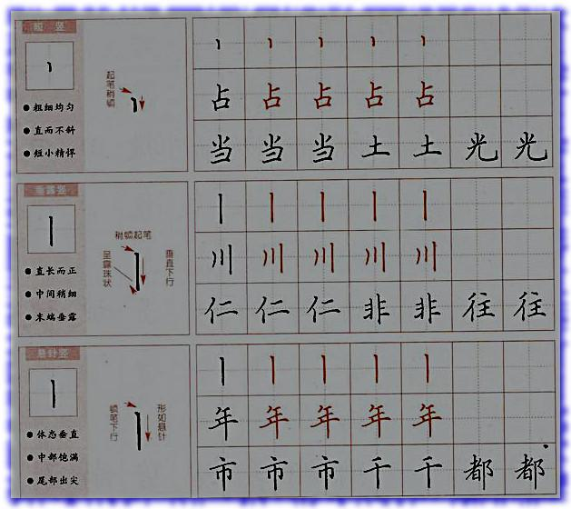 
> 图：三种竖的写法

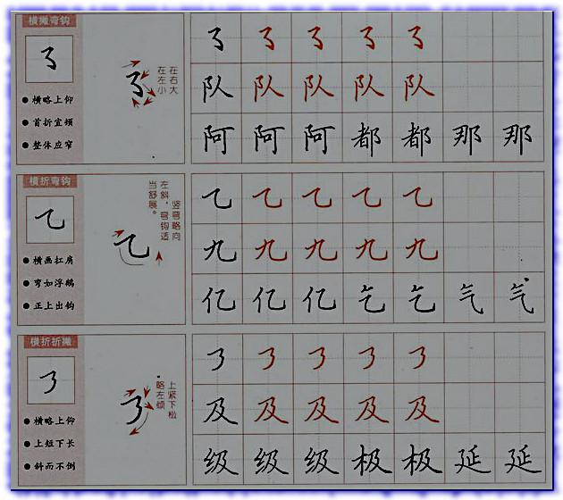 
> 图：折笔的书写方法

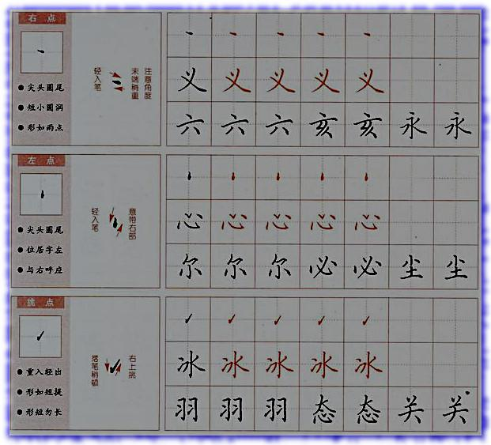 
> 图：点画的书写方法，点是最自由的笔画

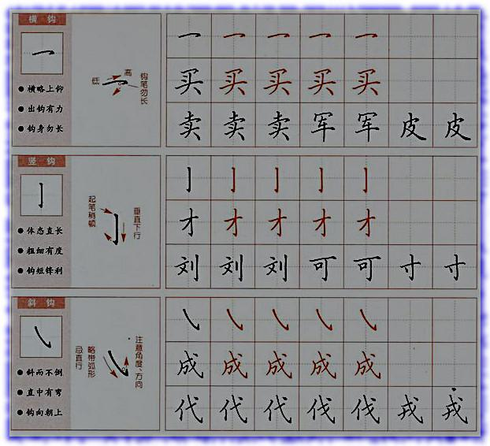 
> 图：折笔书法力求自然

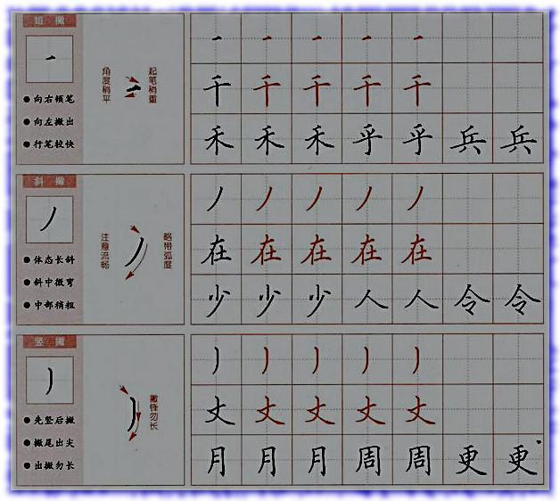

> 图：撇笔是笔画中真正的曲笔

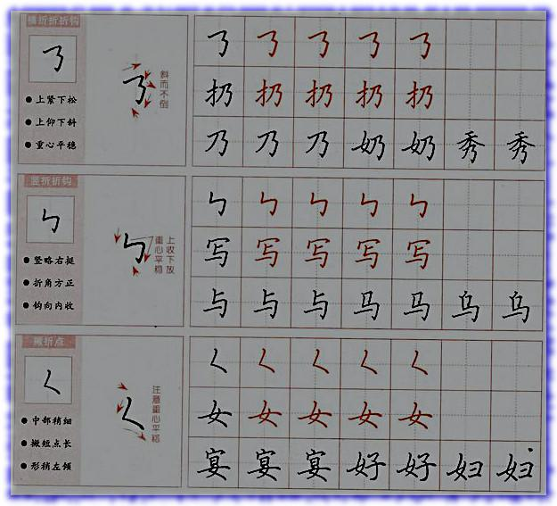

图：折笔在文字中有骨架的作用

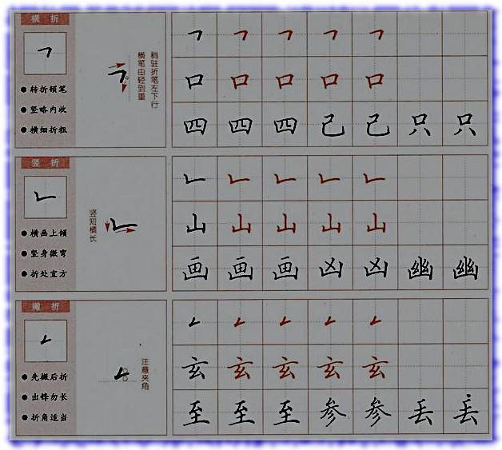 
> 图：折笔书写规范中见变化

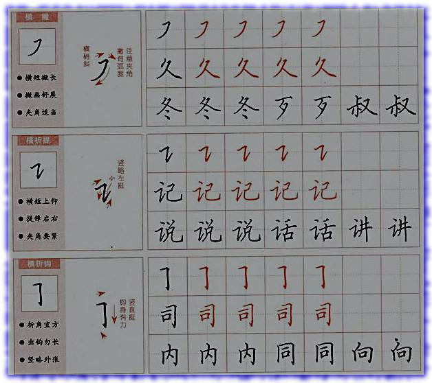 
> 图：长笔画切忌没有身子

笔画是书法中的基本功夫。练习笔画中，尝试在不同的单字中进行比较，分析笔画会出现不同写法的原因，久而久之就可以发现书写中的规律。无论是在书写硬笔或是毛笔，二者之间都有可借鉴之外，尤其是在书写某些笔画不便理解时，就何以借助选毛笔书法大字书写来体会。