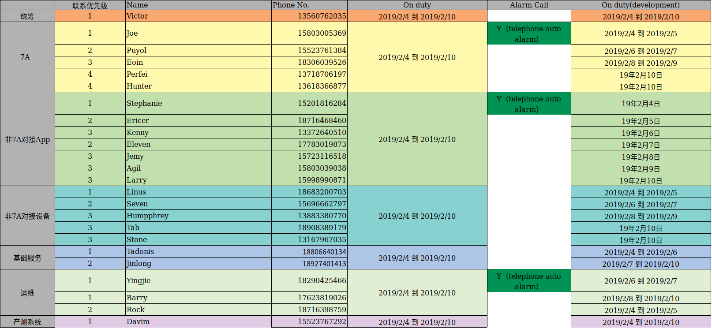

工作内容 2019-01-29

- [ ] 固件灰度进度。 负责人: 彭伟
- [ ] 性能测试环境。 负责人: jankin
- [ ] 产测系统进度。 负责人: 范鸿翔  29上午11:00，服务端接口提测。web端还没完成
- [ ] 日志系统

***

## 29日，工作完成情况

- [x] 1. 10A，7A冒烟测试上线；（10A以上生产环境,7A 29日以上联调环境，计划30日上生产环境）
- [ ] 2. 10A性能摸底完成；（29日运维完成环境搭建后，通知测试开始按计划压测）
- [ ] 3. 数据库监控和数据量统计完成；（监控在联调环境部署完成，需要做一下压测，没问题后上生产环境，计划春节前上线）
- [ ] 4. 线上周报完成；
- [ ] 5. vesyncfit老产品背景讨论；
- [ ] 6. ~~10A数据库迁移完成上线；~~ (延期至春节后一周)
- [x] 7. 日志查询系统完成；
- [x] 8. 春节值班表制定。

-----

@Joe何泓蛟（重庆） ，帮忙跟进下上面的事情哈
10A数据库迁移放到春节后一周

~~ajdk

