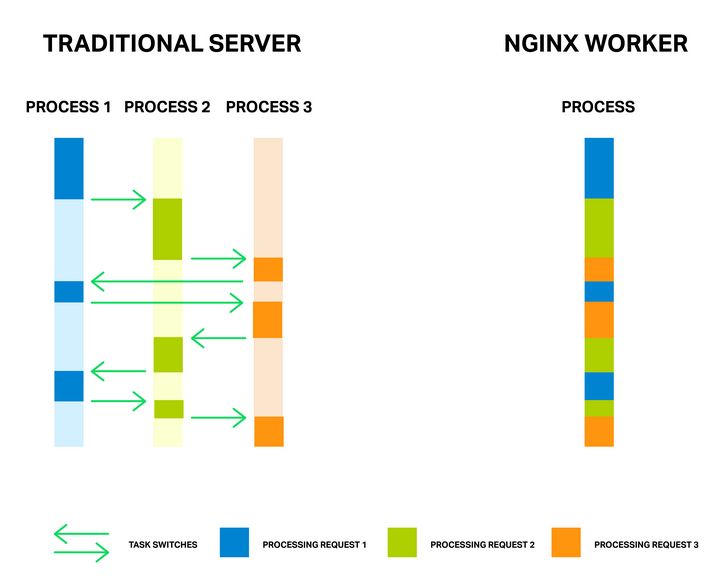

Nginx线程池性能提升9倍（Thread Pools in NGINX Boost Performance 9x!） - 小朋友的爪哇岛

五年级英语水平，端午家庭作业。

Nginx以异步、事件驱动的方式处理连接。传统的方式是每个请求新起一个进程或线程，Nginx没这样做，它通过非阻塞sockets、epoll、kqueue等高效手段，实现一个worker进程处理多个连接和请求。

一般情况下下是一个CPU内核对应一个worker进程，所以worker进程数量固定，并且不多，所以在任务切换上消耗的内存和CPU减少了。这种方式很不错，在高并发和扩展能力等方面都能体现。

看图说话，任务切换不见了。

但是异步事件模式很不喜欢阻塞（blocking）。很多第三方模块使用了阻塞模式的调用，有时候，用户乃至模块作者都不知道到阻塞调用会大大降低Nginx的性能。

Nginx自己的代码都有一些场景需要使用到阻塞，所以在1.7.11版本中，引入了新的“线程池”机制，在了解这个机制前，我们先瞅瞅阻塞。

了解阻塞前，先讲两句

Nginx其实就是一个事件处理器，接收内核发出的所有与connections相关的事件信息，然后告诉操作系统该做什么。操作系统如此复杂和底层，所以Nginx的指挥必须叼。

从上图看，有超时、sockets准备好读写、错误通知等事件。这些事件都放在一个队列中，Nginx对事件队列进行处理。

如果一个事件对于到的操作非常耗时，那么整个队列的处理就会延迟。

“阻塞操作”就是这样一个导致队列处理延迟的什么鬼。举个例子，CPU密集型计算，资源访问（硬盘、mutex、同步访问数据库等等）。发生阻塞时，worker进程只能等待。

就跟过安检时一样，如果你的队伍里面有个小朋友带了一大瓶AD钙奶，那你只有等他喝完。

有些系统提供的异步文件接口,例如FreeBSD。Linux也提供了类似机制，但是不太好用。首先它要求文件或缓存是扇区对齐的，好吧，Nginx能做到。其次更苛刻的一点是，它要求文件设置O_DIRECT标志位，这就是说，所有访问这个文件的操作都是直接读取，不走任何缓存，这样反而会增加磁盘IO负担。

问了解决这些问题，1.7.11版本中引入了线程池。

你家楼下的顺丰快递就是一个线程池，不用每次寄快递都要去顺丰总部，狗屎一样的比喻。。

对Nginx来说，线程池的作用跟快递点一样。它包括一个任务队列以及配套线程。当一个worker进行需要处理阻塞操作时，它会将这个任务交给线程池来完成。

这里引入了一个新的队列，在例子中，这个队列因为读取资源导致缓慢，读取硬盘虽然慢，至少它不会影响事件队列的继续处理。

任何阻塞操作都可以放到线程池中。目前，我们只尝试了两个核心操作：主流操作系统的read()系统调用和Linux上的sendfile()。后续经过性能测试会考虑纳入更多的操作。

为了证实上述理论，进行了如下测试，测试场景包括各种阻塞操作和非阻塞操作。

我们在一台48G内存的机器上生成了总共256的随机文件，每个文件大小为4MB。这样做的目的是保证数据不受内存缓存影响。

简单的配置如下：

    worker_processes 16;
    
    events {
        accept_mutex off;
    }
    
    http {
        include mime.types;
        default_type application/octet-stream;
    
        access_log off;
        sendfile on;
        sendfile_max_chunk 512k;
    
        server {
            listen 8000;
    
            location / {
                root /storage;
            }
        }
    }
    

配置中进行了一些调优：禁用logging和accpet\_mutex，启用sendfile并设置sendfile\_max_chunk，有利于减少阻塞调用sendfile时带来的总时间。

测试机器配置为双Intel至强E5645（共12核-24线程），10G网卡，四块西数1003FBYX组成的RAID10，系统为Ubuntu Server 14.04.1 LTS。

两台配置一样的客户端，一台机器通过Lua和wrk随机产生200个并发请求，每个请求都不会命中缓存，所以Nginx处理时会产生读盘阻塞操作。另一台机器则是产生50个并发请求，每个请求读取固定文件，频繁的文件读取会命中缓存，所以一般情况下此类请求处理速度较快，当worker进程阻塞时请求速度会受影响。

通过ifstat和在第二台机器上wrk来监控系统吞吐性能。

无线程池结果

    % ifstat -bi eth2
    eth2
    Kbps in  Kbps out
    5531.24  1.03e+06
    4855.23  812922.7
    5994.66  1.07e+06
    5476.27  981529.3
    6353.62  1.12e+06
    5166.17  892770.3
    5522.81  978540.8
    6208.10  985466.7
    6370.79  1.12e+06
    6123.33  1.07e+06
    

吞吐量大约是1Gbps，从top看，所有的worker进程主要消耗在阻塞I/O上（top中的D状态）

    top - 10:40:47 up 11 days,  1:32,  1 user,  load average: 49.61, 45.77 62.89
    Tasks: 375 total,  2 running, 373 sleeping,  0 stopped,  0 zombie
    %Cpu(s):  0.0 us,  0.3 sy,  0.0 ni, 67.7 id, 31.9 wa,  0.0 hi,  0.0 si,  0.0 st
    KiB Mem:  49453440 total, 49149308 used,   304132 free,    98780 buffers
    KiB Swap: 10474236 total,    20124 used, 10454112 free, 46903412 cached Mem
    
      PID USER     PR  NI    VIRT    RES     SHR S  %CPU %MEM    TIME+ COMMAND
     4639 vbart    20   0   47180  28152     496 D   0.7  0.1  0:00.17 nginx
     4632 vbart    20   0   47180  28196     536 D   0.3  0.1  0:00.11 nginx
     4633 vbart    20   0   47180  28324     540 D   0.3  0.1  0:00.11 nginx
     4635 vbart    20   0   47180  28136     480 D   0.3  0.1  0:00.12 nginx
     4636 vbart    20   0   47180  28208     536 D   0.3  0.1  0:00.14 nginx
     4637 vbart    20   0   47180  28208     536 D   0.3  0.1  0:00.10 nginx
     4638 vbart    20   0   47180  28204     536 D   0.3  0.1  0:00.12 nginx
     4640 vbart    20   0   47180  28324     540 D   0.3  0.1  0:00.13 nginx
     4641 vbart    20   0   47180  28324     540 D   0.3  0.1  0:00.13 nginx
     4642 vbart    20   0   47180  28208     536 D   0.3  0.1  0:00.11 nginx
     4643 vbart    20   0   47180  28276     536 D   0.3  0.1  0:00.29 nginx
     4644 vbart    20   0   47180  28204     536 D   0.3  0.1  0:00.11 nginx
     4645 vbart    20   0   47180  28204     536 D   0.3  0.1  0:00.17 nginx
     4646 vbart    20   0   47180  28204     536 D   0.3  0.1  0:00.12 nginx
     4647 vbart    20   0   47180  28208     532 D   0.3  0.1  0:00.17 nginx
     4631 vbart    20   0   47180    756     252 S   0.0  0.1  0:00.00 nginx
     4634 vbart    20   0   47180  28208     536 D   0.0  0.1  0:00.11 nginx
     4648 vbart    20   0   25232   1956    1160 R   0.0  0.0  0:00.08 top
    25921 vbart    20   0  121956   2232    1056 S   0.0  0.0  0:01.97 sshd
    25923 vbart    20   0   40304   4160    2208 S   0.0  0.0  0:00.53 zsh
    

IO受磁盘限制，CPU多数处于空闲状态。wrk结果表明性能也较低。

    Running 1m test @ http:
      12 threads and 50 connections
      Thread Stats   Avg    Stdev     Max  +/- Stdev
        Latency     7.42s  5.31s   24.41s   74.73%
        Req/Sec     0.15    0.36     1.00    84.62%
      488 requests in 1.01m, 2.01GB read
    Requests/sec:      8.08
    Transfer/sec:     34.07MB
    

需要提醒的是，这些请求原本是应该命中缓存非常快速的，但是因为worker进程受第一台服务器的200并发影响，所以最终比较慢。

接下来对照线程池实验，在location配置中添加一个aio线程指令

    location / {
        root /storage;
        aio threads;
    }
    

重新加载Nginx配置后，重复上述测试

    % ifstat -bi eth2
    eth2
    Kbps in  Kbps out
    60915.19  9.51e+06
    59978.89  9.51e+06
    60122.38  9.51e+06
    61179.06  9.51e+06
    61798.40  9.51e+06
    57072.97  9.50e+06
    56072.61  9.51e+06
    61279.63  9.51e+06
    61243.54  9.51e+06
    59632.50  9.50e+06
    

哇，产生了9.5Gbps的吞吐性能。

性能没准还能更改，因为已经达到了网卡瓶颈。这次，worker进程主要消耗在sleeping和时间等待上（top中的S状态）。

    top - 10:43:17 up 11 days,  1:35,  1 user,  load average: 172.71, 93.84, 77.90
    Tasks: 376 total,  1 running, 375 sleeping,  0 stopped,  0 zombie
    %Cpu(s):  0.2 us,  1.2 sy,  0.0 ni, 34.8 id, 61.5 wa,  0.0 hi,  2.3 si,  0.0 st
    KiB Mem:  49453440 total, 49096836 used,   356604 free,    97236 buffers
    KiB Swap: 10474236 total,    22860 used, 10451376 free, 46836580 cached Mem
    
      PID USER     PR  NI    VIRT    RES     SHR S  %CPU %MEM    TIME+ COMMAND
     4654 vbart    20   0  309708  28844     596 S   9.0  0.1  0:08.65 nginx
     4660 vbart    20   0  309748  28920     596 S   6.6  0.1  0:14.82 nginx
     4658 vbart    20   0  309452  28424     520 S   4.3  0.1  0:01.40 nginx
     4663 vbart    20   0  309452  28476     572 S   4.3  0.1  0:01.32 nginx
     4667 vbart    20   0  309584  28712     588 S   3.7  0.1  0:05.19 nginx
     4656 vbart    20   0  309452  28476     572 S   3.3  0.1  0:01.84 nginx
     4664 vbart    20   0  309452  28428     524 S   3.3  0.1  0:01.29 nginx
     4652 vbart    20   0  309452  28476     572 S   3.0  0.1  0:01.46 nginx
     4662 vbart    20   0  309552  28700     596 S   2.7  0.1  0:05.92 nginx
     4661 vbart    20   0  309464  28636     596 S   2.3  0.1  0:01.59 nginx
     4653 vbart    20   0  309452  28476     572 S   1.7  0.1  0:01.70 nginx
     4666 vbart    20   0  309452  28428     524 S   1.3  0.1  0:01.63 nginx
     4657 vbart    20   0  309584  28696     592 S   1.0  0.1  0:00.64 nginx
     4655 vbart    20   0  30958   28476     572 S   0.7  0.1  0:02.81 nginx
     4659 vbart    20   0  309452  28468     564 S   0.3  0.1  0:01.20 nginx
     4665 vbart    20   0  309452  28476     572 S   0.3  0.1  0:00.71 nginx
     5180 vbart    20   0   25232   1952    1156 R   0.0  0.0  0:00.45 top
     4651 vbart    20   0   20032    752     252 S   0.0  0.0  0:00.00 nginx
    25921 vbart    20   0  121956   2176    1000 S   0.0  0.0  0:01.98 sshd
    25923 vbart    20   0   40304   3840    2208 S   0.0  0.0  0:00.54 zsh
    

就是说，CPU还是很富裕。

wrk的结果相差无几

    Running 1m test @ http:
      12 threads and 50 connections
      Thread Stats   Avg      Stdev     Max  +/- Stdev
        Latency   226.32ms  392.76ms   1.72s   93.48%
        Req/Sec    20.02     10.84    59.00    65.91%
      15045 requests in 1.00m, 58.86GB read
    Requests/sec:    250.57
    Transfer/sec:      0.98GB
    

4MB文件的请求时间从7.41秒提升至了226.32毫秒（约33倍），QPS提升了大约31倍（250比8）。

提升的原因不再赘述，大约就是事件队列没有受阻罢了。

看到这里，是不是立马就想去修改你的生产环境了，且慢。

事实上，绝大多数的read和sendfile都是在缓存页中进行的，操作系统会把频繁使用的文件放在缓存页中。

当你的数据量较小，并且内存足够大时，Nginx已经是处于最佳状态了，开线程池反倒会引入开销。线程池能够良好应对的一个场景，是数据无法被完全缓存，例如流媒体服务器，我们上面的测试环境，就是模拟的流媒体服务。

能否用线程池来提升读操作的性能呢？唯一需要做的，就是能有效区分哪些文件已经被缓存，哪些文件未缓存。

咱们的系统没有提供这样的信息。早在2010年Linux尝试通过fincore()来实现未果。接下来是preadv2()和RWF_NONBLOCK标志位方式，可惜也不好用，具体可以参考内核bikeshedding一文。

哈哈，至少FreeBSD用户可以先喝咖啡了，无需在线程池问题上伤脑筋。

如果你确信引入线程池对性能提升有效，那么咱们可以继续了解一些调优参数。

这些调优都是基于1.7.11+ 版本，编译选项为--with-threads参数。最简单的场景下，仅需在http、server或location区块配置aio thread参数即可

    aio threads;
    

它对应的完整配置是

    thread_pool default threads=32 max_queue=65536;
    aio threads=default;
    

默认情况下包括一个32个线程的线程池，长度为65536的请求队列。如果队列溢出，Nginx会输出如下错误并拒绝请求。

    thread pool "NAME" queue overflow: N tasks waiting
    

这个错误表示这个线程池消费小于生产，所以可以增加队列长度，如果调整无效，说明系统达到了瓶颈。

另外，我们可以调整线程相关的参数，例如对不同场景，可以提供独立的线程池。

    http {
        thread_pool one threads=128 max_queue=0;
        thread_pool two threads=32;
    
        server {
            location /one {
                aio threads=one;
            }
    
            location /two {
                aio threads=two;
            }
        }
    …
    }
    

在未定义max_queue时默认为65536，当设置成0时，服务能力等同线程数量。

假如你的缓存代理服务器有3块磁盘，内存不能放下预期需要缓存的文件，所以我们首先需要让磁盘工作最大化。

一个方式是RAID，好坏兼并。另一个方式是Nginx

    
    
    proxy_cache_path /mnt/disk1 levels=1:2 keys_zone=cache_1:256m max_size=1024G 
                     use_temp_path=off;
    proxy_cache_path /mnt/disk2 levels=1:2 keys_zone=cache_2:256m max_size=1024G 
                     use_temp_path=off;
    proxy_cache_path /mnt/disk3 levels=1:2 keys_zone=cache_3:256m max_size=1024G 
                     use_temp_path=off;
    
    thread_pool pool_1 threads=16;
    thread_pool pool_2 threads=16;
    thread_pool pool_3 threads=16;
    
    split_clients $request_uri $disk {
        33.3%     1;
        33.3%     2;
        *         3;
    }
    
    location / {
        proxy_pass http://backend;
        proxy_cache_key $request_uri;
        proxy_cache cache_$disk;
        aio threads=pool_$disk;
        sendfile on;
    }
    

使用了3个独立的缓存，每个缓存指定到一块磁盘，然后有3个独立的线程池。

split_clients模块用于缓存间的负载均衡。

use\_temp\_path=off参数让Nginx将缓存文件保存至文件同级目录，可以避免缓存更新时磁盘间的文件数据交换。

明天他妈又要上课了

原文地址：[http://nginx.com/blog/thread-pools-boost-performance-9x/](http://nginx.com/blog/thread-pools-boost-performance-9x/)