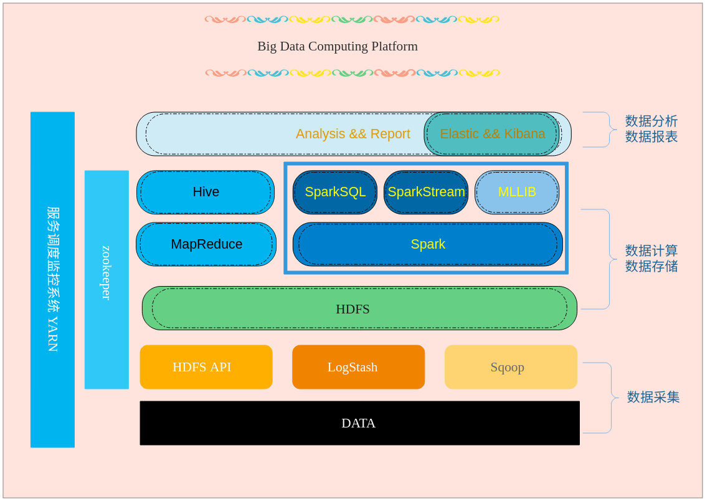

---
toc:
  depth_from: 1
  depth_to: 6
  ordered: false
html:
  embed_local_images: true
  embed_svg: true
  offline: false
  toc: undefined
export_on_save:
  html: false
print_background: false
---

# 数据平台建设方案（1.0 内部使用版）

## 1. 概述

Vesync平台上有着大量的设备实时数据、业务日志以及运维监控数据，基于对这些数据的管理以及分析的需求

考虑要做一个基础大数据分析平台，就需要先搞清楚需求是什么。主要有以下三点：

1. 是可提供大数据的基础能力，包括Hadoop平台的基本功能，数据的导入导出、以及对SQL任务、NoSQL任务、批处理任务的支持;

2. 是在基础之上提高使用效率，所谓的使用是指用户在我们的大数据平台上开发数据业务，包括数据仓库、数据分析，统计、数据可视化、推荐业务等的使用效率，这是大数据平台的核心价值;

3. 是提升管理效率，运营一个大数据平台会涉及到各方面的管理，比如服务调度、服务升级、硬件扩容、技术支持的代价等，我们需要提升管理效率进而降低成本。

## 2. 平台解决现有的痛点

公司目前的业务产生了大量日志以及运维监控数据，为了能实时了解平台上智能产品状态，及时发现用户使用产品的特征，提升智能产品竞争力与使用体验。

1. 数据存储长期有效，随时可以根据需要提取、统计数据指标。目前的数据信息分为日志数据和数据库报表数据。日志数据保存的最长时间不到一个月，而数据库的报表数据，绝大部分来源于对日志数据的分析、统计。因此，当有新需求需要统计新的数据指标时，只能统计最近1个月左右的数据。

2. 新平台统一元数据服务，Hive、Spark等元数据打通，也就是平台上任意一张表既可用Hive查询，也可用Spark来查，不需要在不同系统之间做元数据的同步。而目前我们的分析源数据是日志和ElasticSearch、以及DB，来源多，格式不统一。

3. 通过该平台提供的SQL语法支持，公司被授权的人员可以在上面提取、分析自己感兴趣的数据指标。如: 研发人员可以分析设备的运行状况，市场人员可以分析用户的反馈信息，运营人员可以分析用户的行为习惯，统计业务使用的频率。

4. 解决跨部门数据资源应用不便的问题。现在公司各个部门，包括领导提出来的数据的统计和分析，全都需要研发人员写开发程序来实现。当有新的数据指标要提取的时候，需要从数据的导入、清洗、分析重头来来一次。提取的时间长，开发的难度也较大，并且数据准确性的校验也困难。而通过使用新平台上的SQL组件，各部门的人员可以便捷的提取数据指标，并且可以定制化的展示出来。

5. 实时的运维数据监控分析报警。通过对监控数据实时流数据的分析出来，对异常的业务报警。

## 3. 平台架构图

&emsp;&emsp;对于大数据分析平台的建设，往往不是某个产品就能够满足，而是需要多种不同的产品一起搭建。例如，搭建大数据平台需要大规模数据存储平台，需要数据处理和挖掘工具，分析结果需要通过展现工具体现大数据分析的价值。所以，没有一个完善的大数据生态系统，大数据分析平台是搭建不起来的。
&emsp;&emsp;有鉴于此，我们选择以Hadoop生态为基础的大数据系统，因此就有了如下的平台架构图

&emsp;&emsp;和业内的主流大数据平台类似，我们的大数据平台架构也包括数据采集、存储、管理、分析、算法和可视化。大部分组件都是开源的。整个平台的框架主要分为三层

1. 最底层是数据收集层，典型大数据平台的数据来源多种多样，比如日志、文本、网络流等等。除了数据量大、速度高外、这些数据的一个重要特征是非结构化，也就是不能齐整地转换成传统数据库的表。为此，我们选择`LogStash`和`Sqoop`作为数据采集的组件。

2. 中间层是存储与数据计算层。数据采集后通过清洗存储在该层，基于目前的业务需求，这里我们选择`HDFS`作为存储即可。数据的分析和计算我们选择2种，`Hive`和`Spark`。

3. 最上层是业务应用层。该层面向用户，常常决定整个平台的成败，因为任何系统都是给客户使用得好才能产生价值，而一般的客户是不会通过编程来使用整个平台，可见的永远是可视化层。这一层我们可以选择现有的`Kibana`或者自己通过`web框架`实现定制化需求。

## 4. 组件介绍

1. [Sqoop：SQL–to–Hadoop](http://sqoop.apache.org/)

&emsp;&emsp;正如Sqoop的名字所示：Sqoop是一个用来将关系型数据库和Hadoop中的数据进行相互转移的工具，可以将一个关系型数据库(例如Mysql、Oracle)中的数据导入到Hadoop(例如HDFS、Hive、Hbase)中，也可以将Hadoop(例如HDFS、Hive、Hbase)中的数据导入到关系型数据库(例如Mysql、Oracle)中。就像Hive把SQL翻译成MapReduce一样，Sqoop把你指定的参数翻译成MapReduce，提交到Hadoop运行，完成Hadoop与其他数据库之间的数据交换。

2. [LogStash](https://www.elastic.co/cn/products/logstash)

&emsp;&emsp;Logstash是一个具有实时管道功能的开源数据收集引擎，Logstash可以动态地将来自不同数据源的数据统一起来，并将数据规范化后存放到我们选择的目标存储中，用于各种高级下游分析和可视化用例。

3. [HDFS](https://hadoop.apache.org/docs/stable/hadoop-project-dist/hadoop-hdfs/HdfsUserGuide.html)

&emsp;&emsp;Hadoop Distributed File System，简称HDFS，是一个分布式文件系统。HDFS是一个主/从（Mater/Slave）体系结构，从最终用户的角度来看，它就像传统的文件系h统一样，可以通过目录路径对文件执行CRUD（Create、Read、Update和Delete）操作。

4. [Hive](https://hive.apache.org/)

* hive是基于Hadoop的一个数据仓库工具，可以将结构化的数据文件映射为一张数据库表，并提供完整的sql查询功能，可以将sql语句转换为MapReduce任务进行运行。其优点是学习成本低，可以通过类SQL语句快速实现简单的MapReduce统计，不必开发专门的MapReduce应用，十分适合数据仓库的统计分析。

* Hive是建立在 Hadoop 上的数据仓库基础构架。它提供了一系列的工具，可以用来进行数据提取转化加载（ETL），这是一种可以存储、查询和分析存储在 Hadoop 中的大规模数据的机制。Hive 定义了简单的类 SQL 查询语言，称为 HQL，它允许熟悉 SQL 的用户查询数据。同时，这个语言也允许熟悉 MapReduce 开发者的开发自定义的 mapper 和 reducer 来处理内建的 mapper 和 reducer 无法完成的复杂的分析工作。

5. [Spark](https://spark.apache.org/)

* Spark作为Apache顶级的开源项目，是一个快速、通用的大规模数据处理引擎，和Hadoop的MapReduce计算框架类似，但是相对于MapReduce，Spark凭借其可伸缩、基于内存计算等特点，以及可以直接读写Hadoop上任何格式数据的优势，进行批处理时更加高效，并有更低的延迟。实际上，Spark已经成为轻量级大数据快速处理的统一平台，各种不同的应用，如实时流处理、机器学习、交互式查询等，都可以通过Spark建立在不同的存储和运行系统上。
* Spark是基于内存计算的大数据并行计算框架。Spark基于内存计算，提高了在大数据环境下数据处理的实时性，同时保证了高容错性和高可伸缩性，允许用户将Spark部署在大量廉价硬件之上，形成集群。
* Spark的三个重要扩展
  * Spark SQL: 作为Apache Spark大数据框架的一部分，主要用于结构化数据处理和对Spark数据执行类SQL的查询。通过Spark SQL，可以针对不同格式的数据执行ETL操作（如JSON，Parquet，数据库）然后完成特定的查询操作。
  * Spark Streaming: 用于流式数据的处理。支持高吞吐量和高容错能力的实时流数据处理.
  * Spark MLlib：MLib 是 Spark 的机器学习（ML）库。其目标是使实用的机器学习具有可扩展性并且变得容易。

6. [elastic&&kibana](https://www.elastic.co/cn/)

&emsp;&emsp;Kibana是一个开源的分析与可视化平台，设计出来用于和ElasticSearch一起使用的。我们可以用kibana搜索、查看、交互存放在Elasticsearch索引里的数据，使用各种不同的图表、表格、地图等kibana能够很轻易地展示高级数据分析与可视化。Kibana让我们理解大量数据变得很容易。

## 5. 平台的功能

通常对外（业务）提供数据访问，大体上包含以下方面：

* 离线分析：每天将前一天的数据提供到指定的数据源（如：mysql），离线数据的提供可以采用Sqoop离线数据交换工具。

* 实时流数据：在线运营的推荐系统，需要实时从数据平台中获取给用户的推荐数据，这种要求延时较低。根据延时要求和实时数据的查询需要，可以采用HBase、SparkStreaming、ElasticSearch等.

* 即席数据查询：即席查询的数据比较随意，一般很难建立通用的数据模型，因此可采用：SparkSQL。

## 6. 平台安装部署

